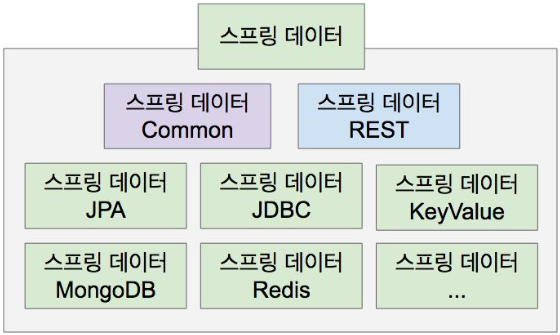
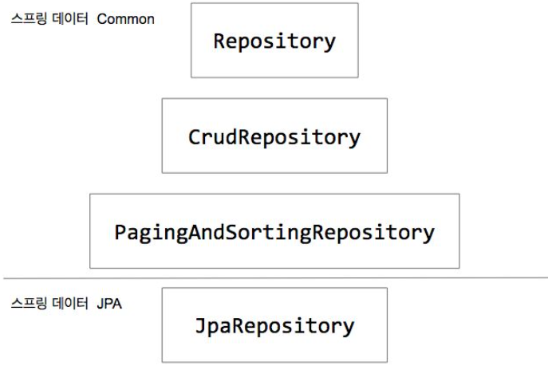
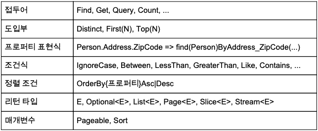

# 스프링 데이터 JPA 
하이버네이트를 사용할 때에는 항상 콘솔의 쿼리를 확인해야 한다. 
항상 하이버네이트가 무슨 쿼리를 발생시키는지 그게 내가 의도한 쿼리인지를 항상 확인해야 한다.  
 

# 예제 프로젝트 준비
 

### 데이터베이스
이 예제에서는 도커를 이용한 Postgres 사용. 
 

#### ∙ 현재 떠있는 컨테이너 확인  
<pre>
$ docker ps
</pre>

#### ∙ 컨테이너는 존재하지만 동작하지 않고 있는(멈춰있는) 컨테이너 확인 
<pre>
$ docker ps -a 
</pre>

#### ∙ 컨테이너 실행
<pre>
$ docker start [컨테이너 이름]
</pre>

#### ∙ 컨테이너 접근 
<pre>
$ docker exec -i -t [컨테이너 이름] bash
</pre>

#### ∙ postgres 접속 
<pre>
$ su - postgres
</pre>

#### ∙ 내가 만든 'springdata' 데이터베이스 접근 
<pre>
$ psql --username rey --dbname springdata
</pre>

#### ∙ 접속한 DB Instance의 테이블 목록 확인 
<pre>
$ \dt
</pre>

#### ∙ 내가 만든 'account' 테이블 조회
<pre>
$ select * from account;
</pre>

#### ∙ postgres 유저 확인
<pre>
$ \du
</pre>

#### ∙ 기타 데이터베이스 설정 정보 
<pre>
현재 이 예제에서는..
postgres 사용자 => rey
데이터베이스 => springdata
account 테이블에 있는 사용자 데이터 => sombrero104 / pass
</pre>
    

# JPA와 하이버네이트 
JPA의 EntityManager가 내부적으로는 하이버네이트를 사용한다.  
때문에 JPA 기반으로 코딩할 수도 있고, 하이버네이트 기반으로 코딩할 수도 있다.  
하지만 대부분의 경우에는 JPA 또는 하이버네이트의 API를 직접적으로 사용하는 경우는 없다.  
 

# JPA의 핵심인 EntityManager 
HibernateJpaAutoConfiguration에서 HibernateJpaConfiguration 설정파일을 가져온다.  
HibernateJpaConfiguration 설정파일의 상위 클래스인 JpaBaseConfiguration을 보면,  
JPA의 핵심인 EntityManagerFactoryBuilder가 entityManagerFactoryBuilder()에서 빈으로 등록이 되는 것을 확인할 수 있다.  
이외에도 entityManagerFactory()에서 EntityManagerFactory를 빈으로 등록하는 것을 확인할 수 있는데  
이것 때문에 우리는 EntityManager를 주입 받아서 사용할 수 있는 것이다.  
이외에도 TransactionManager도 이곳에서 빈으로 등록하는 것을 확인할 수 있다.  
    

# CASCADE
- CASCADE: 엔티티의 상태 변화를 전파 시키는 옵션. 
도메인의 관계가 Parent와 Child 관계에 있을 때 사용할 수 있다.  
예를 들어, Post와 Comment는 Post가 삭제되면 Comment도 삭제된다.  
 

### 잠깐, 엔티티의 상태란?
- Transient: JPA가 모르는 상태.
- Persistent: JPA가 관리중인 상태. (엔티티 객체의 변경사항을 JPA가 모니터링하고 있다는 의미.)  
  Persistent 상태가 되면 하이버네이트가 1차 캐시, Dirty Checking, Write Behind, 등등과 같은 여러가지 일을 해준다. 
  - 1차 캐시: EntityManager, Session을 Persistent Context라고 부르는데 
             save가 되면 이 Persistent Context에 저장이 된다. (즉, 캐시가 된다.)  
             때문에 save 이후, 트랜잭션이 끝나기 전에 조회하는 메소드를 호출하면 DB에서 가져오지 않고 캐시에 있는 것을 꺼내준다.   
             (즉, select 쿼리가 발생하지 않는다.)
  - Dirty Checking: 엔티티 객체의 변경사항을 계속 감지한다는 의미.  
  - Write Behind: 엔티티 객체의 상태 변화를 DB에 최대한 늦게 (가장 필요한 시점에) 적용한다는 의미.  
- Detached: JPA가 더이상 관리하지 않는 상태. 
JPA에 의해 관리되었던 객체가 트랜잭션이 끝나서 Session 밖으로 나온 후 객체가 밖에서 사용이 될 때는 Detached 상태가 된다.  
(예를 들어, Service단에서 Repository를 호출한 후 트랜잭션이 끝나고 객체를 반환해서 다시 Service단에서 객체를 받은 경우.)
- Removed: JPA가 관리하긴 하지만 삭제하기로 한 상태. 실제 커밋이 일어날 때 삭제가 된다. 
 

 
    

# Fetch
연관관계의 엔티티를 지금 가져올 것인지, 나중에 가져올 것인지..
지금(**_Eager_**)? 나중에(**_Lazy_**)?
- @OneToMany의 기본값은 Lazy
- @ManyToOne의 기본값은 Eager
 

## Post 조회
### 1. Post에서 comments가 Lazy인 경우. 
@OneToMany이기 때문에 기본적으로 Lazy모드이다. 
<pre>
select
    post0_.id as id1_2_0_,
    post0_.title as title2_2_0_ 
from
    post post0_ 
where
    post0_.id=?
</pre>  

### 2. Post에서 comments가 Eager인 경우. 
@OneToMany에 'fetch = FetchType.EAGER'로 바꿔주면 
아래와 같이 post만 가져오는데도 comment도 같이 select하는 것을 확인할 수 있다.  
<pre>
Post post = session.get(Post.class, 1l);
System.out.println("##### post.getTitle(): " + post.getTitle());
</pre>
<pre>
select
    post0_.id as id1_2_0_,
    post0_.title as title2_2_0_,
    comments1_.post_id as post_id3_1_1_,
    comments1_.id as id1_1_1_,
    comments1_.id as id1_1_2_,
    comments1_.comment as comment2_1_2_,
    comments1_.post_id as post_id3_1_2_ 
from
    post post0_ 
left outer join
    comment comments1_ 
        on post0_.id=comments1_.post_id 
where
    post0_.id=?
</pre>  

## comment 조회 
### comment를 가져오는 경우
@ManyToOne은 기본적으로 Eager모드이다.   
때문에 아래와 같이 comment만 가져와도 post도 같이 가져오는 것을 확인할 수 있다. 
<pre>
Comment comment = session.get(Comment.class, 2l);
System.out.println("##### comment.getComment(): " + comment.getComment());
System.out.println("##### comment.getPost().getTitle(): " + comment.getPost().getTitle());
</pre>
<pre>
select
    comment0_.id as id1_1_0_,
    comment0_.comment as comment2_1_0_,
    comment0_.post_id as post_id3_1_0_,
    post1_.id as id1_2_1_,
    post1_.title as title2_2_1_ 
from
    comment comment0_ 
left outer join
    post post1_ 
        on comment0_.post_id=post1_.id 
where
    comment0_.id=?
</pre>
    

# JPQL (HQL)
Java Persistence Query Language (Hibernate Query Language) 
SQL과 비슷하지만 가장 큰 차이점은 데이터베이스 테이블을 기준으로 쿼리하는 것이 아닌 엔티티 객체를 기준으로 쿼리하는 것이다.   
JPQL(HQL)이 각 DB에 맞는 SQL로 변환이 되어서 최종적으로 변환된 SQL이 실행됨.  
단점은 문자열이기 때문에 얼마든지 오타가 발생할 수 있다는 것이다. (Type safe하지 않다.)
    

# 스프링 데이터 JPA 원리
아래와 같이 JpaRepository<엔티티 타입, 엔티티 PK>를 상속받는 리파지토리 인터페이스를 만들면 
직접 CRUD를 하는 메소드를 작성하지 않아도 된다. (코드가 간결해진다.) 
그리고 @Repository를 붙이지 않아도 빈으로 등록이 된다.
<pre>
public interface PostRepository extends JpaRepository❮Post, Long❯ { 
                                    // ❮ 엔티티 타입, 엔티티에서 사용하는 아이디(PK 타입) ❯
}
</pre>
<pre>
@Autowired
PostRepository postRepository;
...
    postRepository.findAll().forEach(System.out::println);
</pre>
 

스프링부트가 아닌 스프링프레임워크에서는 @EnableJpaRepositories를 @Configuration인 클래스에 설정해줘야 하는데 
이 @EnableJpaRepositories를 살펴보면 JpaRepositoriesRegistrar 클래스를 임포트하는 것을 확인할 수 있다. 
바로 이 JpaRepositoriesRegistrar이 우리가 만든 리파지토리를 빈으로 등록시키는 역할을 한다. 
최상위에는 ImportBeanDefinitionRegistrar 인터페이스가 있는데 이 인터페이스는 스프링 프레임워크가 제공한다.  
이 ImportBeanDefinitionRegistrar의 구현체는 JpaRepository를 상속받는 인터페이스를 찾아서 프로그래밍으로 빈을 등록해준다.   
    

# 스프링 데이터 JPA 활용
 
- 스프링 데이터: SQL & NoSQL 저장소 지원 프로젝트의 묶음.
- 스프링 데이터 Common: 여러 저장소 지원 프로젝트의 공통 기능 제공.
- 스프링 데이터 REST: 저장소의 데이터를 하이퍼미디어 기반 HTTP 리소스로(REST API로) 제공하는 프로젝트.
- 스프링 데이터 JPA: 스프링 데이터 Common이 제공하는 기능에 JPA 관련 기능 추가. 

http://projects.spring.io/spring-data    

 
- JpaRepository는 PagingAndSortingRepository를 상속 받고 있다. 
- PagingAndSortingRepository는 페이징과 정렬을 지원하는  
findAll(Pageable var1), findAll(Sort var1)을 제공해 준다. 
- 그리고 PagingAndSortingRepository는 CrudRepository를 상속받고 있다.  
CrudRepository는 save(), saveAll(), findById(), existsById(), findAll() 
, findAllById(), count(), delete(), deleteAll()을 제공해 준다. 
- CrudRepository는 Repository를 상속받고 있다.  
Repository는 marker(마커) 인터페이스 역할로 실제로 어떤 기능을 하는 것은 아니다. 

    

# 쿼리 만들기 전략
- 메소드 이름 분석해서 쿼리 만들기. (CREATE)  
메소드 이름을 분석해서 스프링 데이터 JPA가 쿼리를 만들어 준다.
- 미리 정의해 둔 쿼리 찾아 사용하기. (USE_DECLARED_QUERY) 
메소드에 붙어있는 부가적인 정보(@Query 애노테이션 같은 정보들)의 쿼리를 찾아서 사용한다. 
<pre>
@Query("SELECT c FROM Comment AS c")
@Query(value = "SELECT * FROM Comment", nativeQuery = true)
</pre>
- 미리 정의한 쿼리 찾아보고 없으면 메소드 이름 분석해서 만들기. (CREATE_IF_NOT_FOUND) (기본값)
  

### 쿼리 만들기 전략 설정
<pre>
@EnableJpaRepositories(queryLookupStrategy = QueryLookupStrategy.Key.CREATE)
@EnableJpaRepositories(queryLookupStrategy = QueryLookupStrategy.Key.USE_DECLARED_QUERY)
@EnableJpaRepositories(queryLookupStrategy = QueryLookupStrategy.Key.CREATE_IF_NOT_FOUND) (기본값) 
</pre>
QueryLookupStrategy의 구현체를 찾아서 JpaQueryLookupStrategy를 보면  
메소드 이름으로 쿼리를 만들어내는 CreateQueryLookupStrategy와 
이미 정의된 쿼리를 찾아내는 DeclaredQueryLookupStrategy가 있는 것을 확인할 수 있다.  
이미 정의된 쿼리를 찾아내는 DeclaredQueryLookupStrategy를 보면 순서대로  
fromQueryAnnotation()로 @Query 애노테이션을 찾은 후 존재하면 리턴하고, 
그 다음으로 fromProcedureAnnotation()로 @Procedure 애노테이션을 찾은 후 존재하면 리턴하고, 
그 다음으로 getNamedQueryName()로 @NamedQuery를 찾은 후 존재하면 리턴하는 것을 확인할 수 있다.  
때문에 이 세가지를 다 설정하게 되면 @Query가 먼저 적용된다는 것을 알 수 있다. 
  

## 메소드 이름으로 쿼리 만드는 방법 (JPA가 내 의도대로 만들게 하는 방법)
<pre>
public interface PostRepository extends JpaRepository❮Post, Long❯ { 
    Page❮Post❯ findByTitleContains(String title, Pageable pageable);
    long countByTitleContains(String title);
}
</pre>
<pre>
리턴타입 {접두어}{도입부}By{프로퍼티 표현식}(조건식)[(And|Or){프로퍼티 표현식}(조건식)]{정렬 조건} (매개변수)
</pre>
 
    
